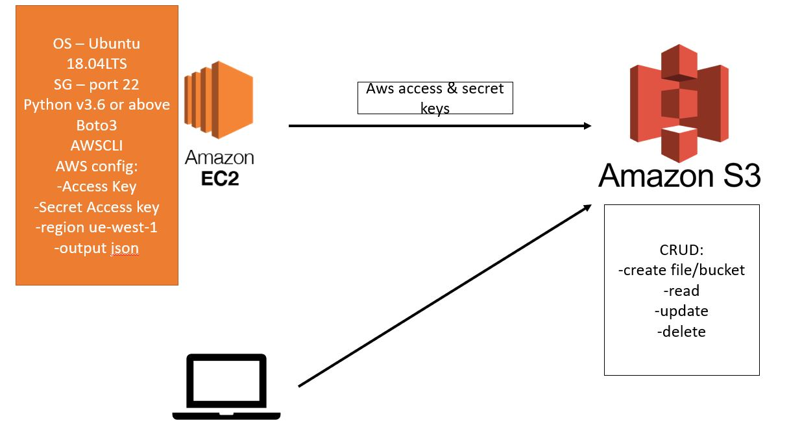
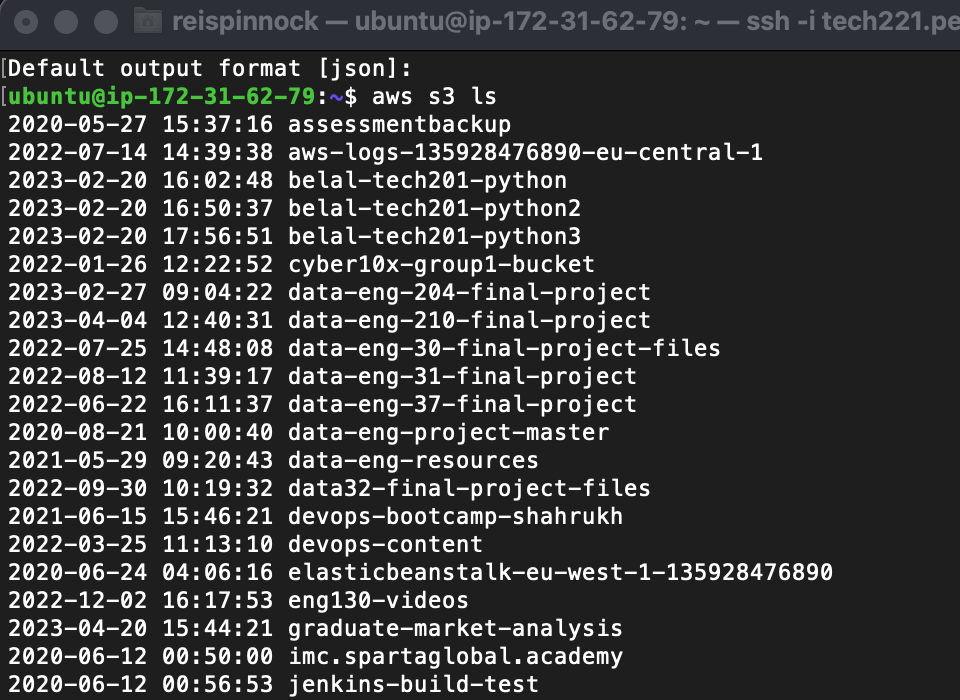

# Disaster Recovery Plan

 Disaster recovery is a way of regaining access and functionality of an organizations IT infrastructure after any type of compromising event i.e. natural disaster, cyber security attack, or human error. 

The objective of a disaster recovery (DR) plan is to ensure that an organization can respond to a disaster or other emergency that affects information systems –and minimize the effect on business operations.

#### Benenfits
 The benefits to having a disaster recovery plan are that:

- Cost Savings - Planning for potential disruptive events can save businesses hundreds of thousands of dollars and even mean the difference between a company surviving a natural disaster or folding.
<br>
- Faster recovery - Depending on the disaster recovery strategy and the types of disaster recovery tools used, businesses can get up and running much faster after a disaster, or even continue operations as if nothing had happened.

#### What is S3?

Amazon Simple Storage Service (Amazon S3) is an object storage service that offers industry-leading scalability, data availability, security, and performance. Customers of all sizes and industries can use Amazon S3 to store and protect any amount of data for a range of use cases.

Amazon S3 provides management features so that you can optimize, organize, and configure access to your data to meet your specific business, organizational, and compliance requirements.

##### Storage classes

s3 works in a storage class format meaning the more you need to access your data in your s3 the more you are charged to store it. But if it is data that is rarely accessed you will be charged less.

These classes range from standard to Glacier Instant retrieval up to Glacier Deep Archive.

#### AWS CLI & SDK's

- CLI - The AWS CLI is an open source tool built using the AWS SDK for Python (Boto3) that provides commands to interact with AWS services. With minimal configuration, you can use all the features provided by the AWS management console from your favorite terminal.
<br>
- SDK's - An AWS SDK (Software Development Kit) is used to interact with AWS within an application. There are therefore many AWS SDKs depending on the different programming languages (Python, Java, C++, JavaScript, Ruby, PHP,…)

### AWS CLI



1. Create an EC2 instance
<br>

2. Make sure all dependencies are installed
``` 
sudo apt update -y

sudo apt upgrade -y

python --version

sudo apt install python -y

alias python=python3

sudo apt install python-pip -y

```

3. Install AWS CLI
```
sudo python3 -m pip install awscli
```

4. Configure the AWS CLI
```
aws configure
```

you will be asked for your access key ID, input.
Then will ask for Secret Access Key, input.

It will ask for region input:
```
eu-west-1
```

Then asks for defualt output format:
```
json
```

5. Now we can test the connection with s3 and see what is available:
```
aws s3 ls
```

If presented with list of options, you have configered it correctly. 



### Applying functions

1. After confirming configeration and seeing what is available we need to see if we can CRUD (create bucket/file, read see/read-info, update and delete).

<br>

2. Now we are making a bucket with a naming convention (<b>Naming convention does not accept _ </b>):
```
aws s3 mb s3://reis-tech221
```

You can check its been created using `aws s3 ls`.

3. Create a file with:
```
sudo nano test.txt
```
Within this file can put anything, we put 
```
# this file is created on ec2 to be uploaded to s3
```

Save as usual.

4. Now we want to upload to s3, giving it a destination using:
```
aws s3 cp test.txt s3://reis-tech221
```

<b>You can check this by going to s3 on AWS and checking file is there. </b>

5. Within AWS navigate to `s3` -> `buckets` -> `click on your bucket` -> ` click on file you created` -> `permissions` -> `edit` -> `allow public access for everyone`.

#### Recovering a Deleted file from AWS S3.

1. Remove this file with:
```
sudo rm test.txt
```

We can recover this from our s3 on AWS using the AWS CLI:
```
aws s3 cp s3://bucket/reis-tech221/test.txt /home/ubuntu
```

You will be shown a message saying "downloaded: ...".

#### Removing bucket from s3

1. We can delete the whole bucket with:
```
aws s3 rb s3://reis-tech221
```
<b>If your bucket is not empty it will not delete it </b>, so you need to delete everything in your bucket with:
```
aws s3 rm s3://reis-tech221/test.txt
```

## S3 and Python Scripting (boto3)

1. We need to make sure that our instance has all the dependencies for boto3
```
sudo apt install python-pip

pip3 install boto3
```

2. We now need to create scripts for each function of boto3, using `sudo nano <script_name>.py` Included is a print statement after each script so we know it has been successful:

- Create Bucket Script (create.py):
```
import boto3

s3 = boto3.resource('s3')

s3.create_bucket(Bucket='reis-tech221', CreateBucketConfiguration={
    'LocationConstraint': 'eu-west-1'})

print('Bucket created')
```

- Upload file Script (upload.py):
```
import boto3

s3 = boto3.resource('s3')

client = boto3.client('s3')
s3 = boto3.resource('s3')

bucket_name="reis-tech221"

s3.Bucket(bucket_name).upload_file('/home/ubuntu/test.txt','test.txt')

print('File Uploaded')
```

- Delete file script (delete_file.py):
```
import boto3

s3 = boto3.resource('s3')

s3.Object(bucket_name, 'test.txt').delete()

print('File Deleted')
```

- Delete Bucket Script(delete_bucket.py):
```
import boto3

s3 = boto3.resource('s3')

bucket = s3.Bucket('reis-tech221')
bucket.delete

print('Bucket deleted')
```

3. Now within our instance we can run these scripts with:

```
python3 <script_name>.py
```